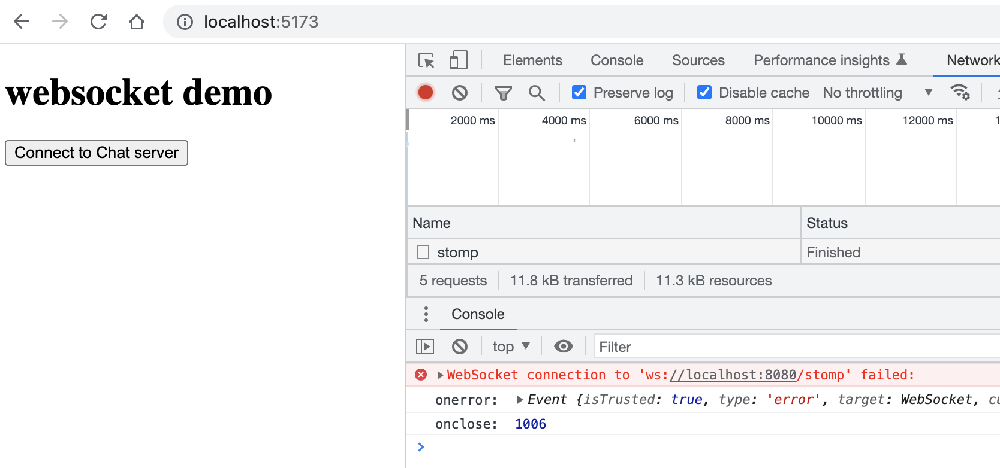
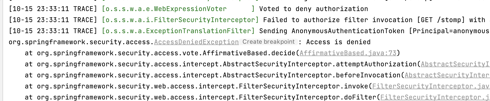
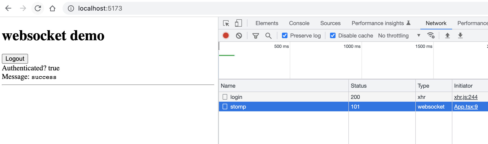
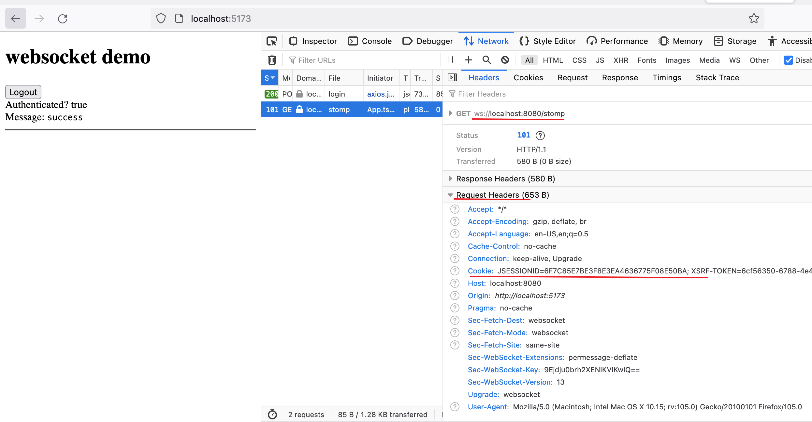
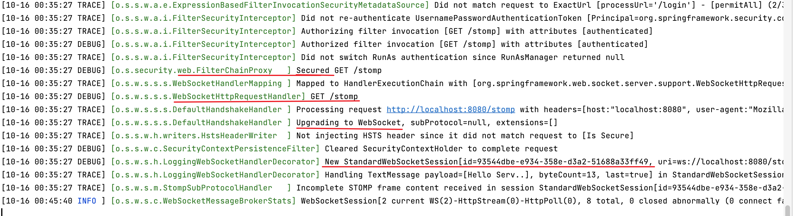
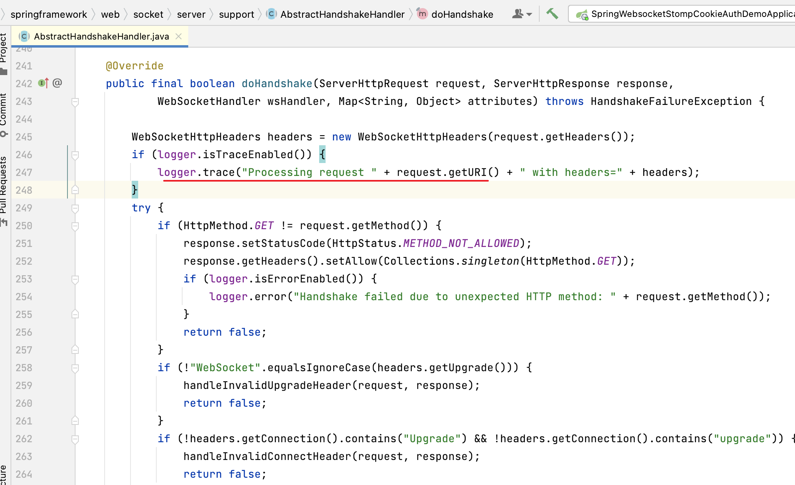

## Environment

- Java 17
- Spring Boot 2.7.4
- React 18.2.0

## Checkpoint

- [x] Check ws://localhost:8080/stomp endpoint is protected by spring security
- [x] Check cookie exist in http request header when doing websocket handshake
- [ ] Check Principal is available in controller layer
- [ ] Check SecurityContextHolder is available
- [ ] Check client automatically disconnected by spring security upon `/logout`?

## #1 WS endpoint protected by default ✅

不登录，尝试直接链接websocket， 报错:


注意你无法知道ws error的具体描述信息，
见[Websocket onerror - how to read error description?](https://stackoverflow.com/questions/18803971/websocket-onerror-how-to-read-error-description)

后台错误日志:


代码:

```tsx
function App() {
    const [connected, setConnected] = useState(false)

    let ws: WebSocket

    function onConnect() {
        ws = new WebSocket('ws://localhost:8080/stomp')

        ws.onopen = (event) => {
            console.log('on open ..')
            ws.send('Hello Server!')
            setConnected(true)
        }

        ws.onmessage = (event) => {
            console.log('on message: ', event.data)
        }

        ws.onerror = (event) => {
            console.log('onerror: ', event)
        }

        ws.onclose = (event) => {
            console.log('onclose: ', event.code, event.reason)
            setConnected(false)
        }
    }

    return <></>
}
```

## #2 Cookie exists when doing websocket handshake ✅

点击Login按钮，axios会将cookie和csrf token写到浏览器。(过程详见上一个demo)

然后点击Connect to Chat server, 可以看到Chrome浏览器发起ws链接请求

此处， chrome浏览器会隐藏Cookie request header(在dev tool中看不见Cookie)

换成firefox浏览器可以清楚的看到.


spring security根据cookie中的JSESSIONID恢复http session， 并创建相应的websocket session。



通过后台日志也能找到相应的cookie值。

> 【o.s.w.s.s.s.WebSocketHttpRequestHandler】GET /stomp
>
>【o.s.w.s.s.s.DefaultHandshakeHandler】Processing request http://localhost:8080/stomp with headers=host:"localhost:
> 8080",
> user-agent:"Mozilla/5.0 (Macintosh; Intel Mac OS X 10.15; rv:105.0) Gecko/20100101 Firefox/105.0", accept:"*/*",
> accept-language:"en-US,en;q=0.5", accept-encoding:"gzip, deflate, br", sec-websocket-version:"13",
> origin:"http://localhost:5173", sec-websocket-extensions:"permessage-deflate", sec-websocket-key:"
> 9Ejdju0brh2XENlKVlKwlQ==", connection:"keep-alive, Upgrade", cookie:"JSESSIONID=6F7C85E7BE3F8E3EA4636775F08E50BA;
> XSRF-TOKEN=6cf56350-6788-4e48-a0c6-c9c4061921ad", sec-fetch-dest:"websocket", sec-fetch-mode:"websocket",
> sec-fetch-site:"same-site", pragma:"no-cache", cache-control:"no-cache", upgrade:"websocket"
>
>【o.s.w.s.s.s.DefaultHandshakeHandler】Upgrading to WebSocket, subProtocol=null, extensions=[]

重要的源代码:



